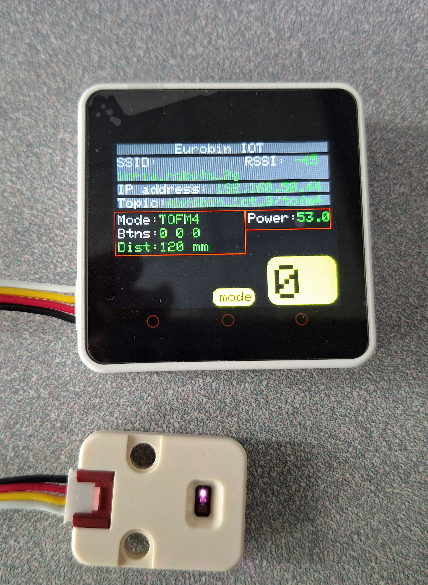

# EUROBIN IOT

## Concept

The ideia is to make a software that is fairly easy to connect a sensor to the control and start to work without doing a lot of things. It use Micro Ros and ROS2 to send and receive data from the sensors. 
## Hardware

The project support for the moment [Core2](https://docs.m5stack.com/en/core/core2), [Atom Matrix](https://docs.m5stack.com/en/core/atom_matrix) and [Atom Lite](https://docs.m5stack.com/en/core/atom_lite) from M5Stack.

## Supported sensors

All the sensors used are from the company [M5Stack](https://m5stack.com/) (except the Photoelectric Sensor), you can see bellow the list of sensors used.

- [Time of Flight M2 (Tof)](https://docs.m5stack.com/en/unit/TOF)
- [Time of Flight M4 (tof)](https://docs.m5stack.com/en/unit/Unit-ToF4M)
- [Scale](https://docs.m5stack.com/en/unit/scales)
- [Hall](https://docs.m5stack.com/en/unit/hall)
- [Key](https://docs.m5stack.com/en/unit/key)
- [Rfid](https://docs.m5stack.com/en/unit/uhf_rfid)
- [Photoelectric Sensor](https://docs.rs-online.com/794c/A700000007648217.pdf)

## Libraries
 - [Micro Ros PlatformIO](https://github.com/micro-ROS/micro_ros_platformio).
 - [M5Core2](https://github.com/m5stack/M5Core2).
 - [M5Atom](https://github.com/m5stack/M5Atom).
 - [FastLED](https://github.com/FastLED/FastLED).
 - [M5Unit Scales](https://github.com/m5stack/M5Unit-Scales/).
 - [M5Unit UHF RFID](https://github.com/m5stack/M5Unit-UHF-RFID). 
 - [VL53L1X](https://github.com/pololu/vl53l1x-arduino).


## Compilation and Installation

The project was developed under the Linux Ubuntu 22.04.4 LTS and PlatformIO from VScode.  
First, intall the packages necessary to PlarformIO handle Micro Ros.

```shell
apt install -y git cmake python3-pip
```
It is necessary to install **Docker** because it's used to see the topics publishing and subscribing.

Clone the project and go to the folder *src/*. You need to configure the wifi so the controller can communicate with the local network. Go to the file *config_example.h* and put the information about your network, then rename to *config.h*.

To upload the code on the Core2 or Atom Matrix, you have to go in the file **platformio.ini** and choose the enviromment you want to use (atom-matrix,m5stack-core2 or atom-lite), after change it, save the file so it can be updated, then you can change the code and upload on the microcontroller.

**Important: The Library M5Unit UHF RFID has a problem, inside it's file called UNIT_UHF_RFID.cpp, the ligne "#include "Unit_UHF_RFID.h"" shoud be "#include "UNIT_UHF_RFID.h"", you must do this change so it can build and upload correctly** 

Important 2: Before use any command of ROS2, you must create a docker container using the command: 

```shell
docker run -it --net host ros:humble
```


## Core 2

Here is a image of a Core2 running the code.



You can see on the screen some information such as SSID, RSSI and IP Adress. You can see the **mode** that inform what sensor is working on the Core2, in this case it's the sensor ToFM4, it has the data the sensor is seeding to the control. The big number in a yellow background, this is the ID of the controller, it must be a unique ID for each control nad it is used to send information to a topic using ROS2, if there are 2 controllers with the same ID, you have to change it for one of them.
The power show the level of battery in percentage the Core2 has at the moment, it's updated each minute in the screen.

The information **Topic** showed on the screen informs you what is the name of the topic that is publishing the information of the sensor.

If you want to change the sensor (mode), touch the middle button (the one bellow the sign "mode" in yellow box) and keep it pressed for 5 seconds, it will change for the next mode, you can keep pressing the button to change multiple times the mode until it reach the wished mode. After you have the mode you want, connect the sensor and reset the Core2. It will restart the control and it's going to work with the sensor connected.


If you want to change the ID, keep pressed the right button, it's going to start a counter and you have to keep the button pressed until the counter reach 50, after that the Core2 will restart automatically with a new ID.


You can see if the Core2 is really publishing this information in a topic, you just have to create a docker container using the command bellow

```shell
docker run -it --net host ros:humble
```
Inside the container you can check the topics working at the moment with the command 

```shell
ros2 topic list
``` 


Choose the topic you want to see the result and write the command 

```shell
ros2 topic echo <name_of_the_topic>
```
In our case, we want to see the distance of the sensor ToF in the control with the ID 0

```shell
ros2 topic echo eurobin_iot_0/tofm4
```

Bellow is the output from the terminal, in this case is the distance in mm, this is the information the sensor is giving to the controller and then being publishing it. 


## Atom Matrix

Here is an image of the Atom Matrix running the code. It's running on a ESP32 Pico and It has a button and a Matrix of Leds 5x5.


Because the microcontroller does not have a screen, we have had to change the logic in how to show the information. 
In the Image, you can see a red letter "E" and 2 green leds. The letter E actually makes part of the word Scale, so this is indicating the mode (sensor) in red color, the word scroll all the time to show the mode, the ID is showed too following the mode in white color. You can change the color of booth in the code (variables colorMode and colorID).

The first green led (the higher one) indicates that the connection with the network was successful, the contrary it would show a red led. When you turn on the atom, it can starts with a led red but it's advised to wait a little becase the controller tries several times to connect with the network, so it can turn in green after some time.

The second green led(the lower one) indicates that the connection I2C or the initialization with the sensor was successful, if not it would display a red led.  Only the sensors Tof (M2 and M4), Scale and Rfid shows this led, the others such as Hall and Key does not show because it's is just a digital read. 

To change the mode it's just necessary to make a double click, if it's done correctly, the first column will start to blink (between red and blue), this indicate you can reset the controller so it will restart with the new mode.


To change the ID, it's just necessary to keep pressing the button for 5 seconds, after this, all the matrix of leds will be blue to indicate that the controller is going to reset itself and when turn on again, it will have a new id.


## Atom Lite

The Atom Lite it's very similar to the Atom Matrix, the only differences are that the Lite does not have a Matrix of Leds, It has only a button and a Led. Bellow is a photo of the Atom Lite running the code


The Led indicates the status of the connection with the network. If it's connected, the led will be green, if not, it will be red.

The button is used to change the mode (the sensor the controller is using), keep pressing the button of 5 seconds, after this, the Led will start to blink(red and blue), this means you can reset the controller to change the mode.

Because the lack of screen or more leds, we can not show the ID and Mode of the controller. You can set the controller directly on the code by going to the file *config_example.h* and change the variable *id* from the namespace *atom_lite*. To see the Mode, you can do it by cheking the topics that are activated (using the command "ros2 topic list"), because you already know the id, you know what is the mode by the name of the topic. Anothe way to check the Mode is seeing the Serial Monitor, there you will find usefull informations such as the Id, mode, status of the connection with the network and etc.


## Service

Service is another method of communication for nodes, beside the topic. The difference between Service and Topic is that the second aways allow the node to subscribe the data stream and get continual updates while the first will send information only when asked for the client. In our case we will use the service to send a command on the terminal to change the Mode of the controller. 

Create a docker container to see and use the services:

```shell
docker run -it --net host ros:humble
```

To see all the services available, use the command:

```shell
ros2 service list
```


We use a service that is already availble in the library: Empty. No actual data is exchanged between the server and the client. To change the Mode, use the command:

```shell
ros2 service call <name_service> std_srvs/srv/Empty
```

For the Core2, you will see that the mode changed on the screen, you can run again the command until it has the Mode you want, after just restart the controller. For Atom Matrix and Atom Lite, when the command is sent, they will start to blink (the same thing when you changed manually using the bottons), after that, restart the controller and use the command again to change to the next mode, repeat this until you have what you want.


# Visualising Information in 3 Contexts with GUI

In the folder *ros2_ws/src*, there are 3 different projects: 
    - Washing Machine (meta_node)
    - Detect Objects within a fridge (fridge)
    - Robot race (timer)

1. Washing Machine: we have 3 sensors and we want to know if the door, the top drawer and the bottom drawer are opened or not. For this, 3 sensor were used: 1 Hall sensor and 2 ToF.

2. Detect Machine: We want to detect objects that are put inside the fridge, each object will have a tag and we will use the sensor UHF RFID to detect them. 

3. Robot race: We want to count the time a robot take to move from one point to another, when the robot pass the start point, it starts to count the time, when the robot arrive in the second point, the counter will stop and the screen will show how much time took to move between the two points. In this case we will use Photoelectric Sensor to detect the robot.

For the GUI we will use Pyqt6. 

Go to the folder docker/ and build the dockerfile to create an image. To build the file, use the command: 

```shell
docker build .
```

After the image is created, run the .sh file to execute the commands and create a container from the image created by the dockerfile. First, give permission to execute the file

```shell
sudo chmod +x command.sh
```

Then execute the file with the absolute path of the folder *ros2_ws* as argument:

```shell
./command.sh <absolute path of ros2_ws>
```

## Parameters

A parameter is a configuration value of a node, it's the settings of a node. A node can store several parameters with diffent values such as string, integer, float, etc. In our case we will use parameters to inform the subscriber what is the name of the topic he must retrive the data. The name of the topic depends on the id and the mode, because in each case the mode are fixeds, we only have to worry about the ids, so you have to configurate the parameters based on the id of the controllers you are using. Go to src/name_package/lauch/parameters_launch.py and change the id, don't forgete to save the file.

 - Timer: capteur1 = start point / capteur2 = end point
 - fridge: capteur1 = sensor rfid
 - meta_node: capteur1 = Door / capteur2 = top drawer / capteur3 = bottom drawer


Inside the container, go to the folder *ros2_ws* and write the commands:

```shell
rosdep install -i --from-path src --rosdistro humble -y
colcon build --packages-select <name of the package>
source install/setup.bash
ros2 launch <name of the package> parameters_launch.py
```

Every time you change the ID on the code, you must execute these commands again.

This will start the node listener, this node is going to receive all the data from the sensors and open the UI window to see the information, you can see it on the terminal.


## Funding

This code is funded by the Horizon project euROBIN: https://www.eurobin-project.eu/