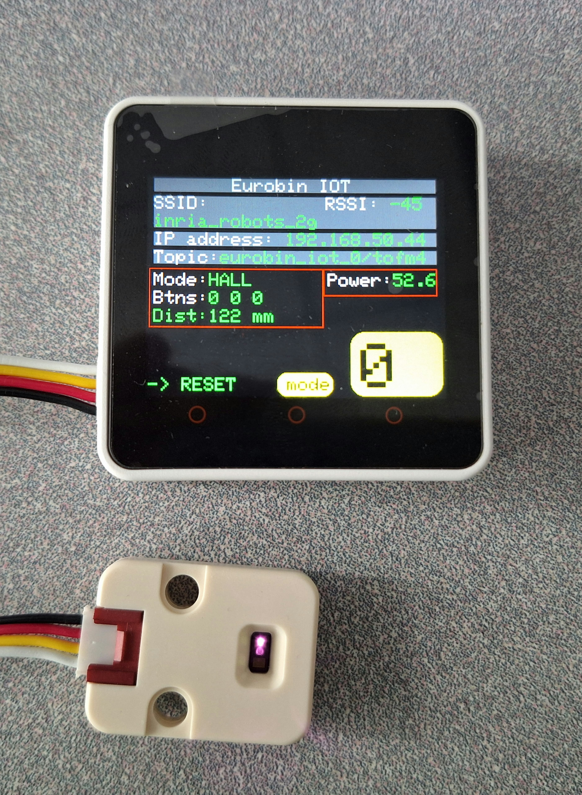

# EUROBIN IOT

## Concept

The ideia is to make a software that is fairly easy to connect a sensor to the control and start to work without doing a lot of things. It use Micro Ros and ROS2 to send and receive data from the sensors. 
## Hardware

The project supports for the moment [Core2](https://docs.m5stack.com/en/core/core2), [Atom Matrix](https://docs.m5stack.com/en/core/atom_matrix) and [Atom Lite](https://docs.m5stack.com/en/core/atom_lite) from M5Stack.

## Supported sensors

All the sensors used are from the company [M5Stack](https://m5stack.com/) (except the Photoelectric Sensor), you can see bellow the list of all sensors used.

- [Time of Flight M2 (ToF)](https://docs.m5stack.com/en/unit/TOF)
- [Time of Flight M4 (ToF)](https://docs.m5stack.com/en/unit/Unit-ToF4M)
- [Scale](https://docs.m5stack.com/en/unit/scales)
- [Hall](https://docs.m5stack.com/en/unit/hall)
- [Key](https://docs.m5stack.com/en/unit/key)
- [Rfid](https://docs.m5stack.com/en/unit/uhf_rfid)
- [Photoelectric Sensor](https://docs.rs-online.com/794c/A700000007648217.pdf)

## Libraries
 - [Micro Ros PlatformIO](https://github.com/micro-ROS/micro_ros_platformio).
 - [M5Core2](https://github.com/m5stack/M5Core2).
 - [M5Atom](https://github.com/m5stack/M5Atom).
 - [FastLED](https://github.com/FastLED/FastLED).
 - [M5Unit Scales](https://github.com/m5stack/M5Unit-Scales/).
 - [M5Unit UHF RFID](https://github.com/m5stack/M5Unit-UHF-RFID). 
 - [VL53L1X](https://github.com/pololu/vl53l1x-arduino).


## Compilation and Installation

The project was developed under the Linux Ubuntu 22.04.4 LTS and PlatformIO from VScode.  
First, install the packages necessary to PlarformIO handle Micro Ros.

```shell
apt install -y git cmake python3-pip
```
It is necessary to install **Docker** because it's used to see the topics publishing and subscribing.

Clone the project and go to the folder *src/*. You need to configure the wifi so the controller can communicate with the local network. Go to the file *config_example.h* and put the information about your network, then rename to *config.h*.

To upload the code on the Core2 or Atom Matrix or Atom Lite, you have to go in the file **platformio.ini** and choose the enviromment you want to use (atom-matrix,m5stack-core2 or atom-lite). After making the changes, save the file so it can be updated. You can then modify the code and upload it to the microcontroller.

**Important: The M5Unit UHF RFID Library has a bug. In its file called UNIT_UHF_RFID.cpp, the line "#include "Unit_UHF_RFID.h"" should be "#include "UNIT_UHF_RFID.h"". You must make this change so it can build and upload correctly.** 

Important 2: Before using any command of ROS2, you must create a docker container using the command: 

```shell
docker run -it --net host ros:humble
```


## Core 2

Here is a image of a Core2 running the code.


You can see on the screen some information such as SSID, RSSI and IP Adress. You can see the **mode** that inform what sensor is working on the Core2, in this case it's the sensor ToFM4, it has the data the sensor is seeding to the control. The big number in a yellow background, this is the ID of the controller, it must be a unique ID for each control nad it is used to send information to a topic using ROS2, if there are 2 controllers with the same ID, you have to change it for one of them.

The power indicator shows the battery level percentage, updated each minute on the screen.

The Topic section on the screen informs you of the topic name publishing the sensor information.

To change the sensor (mode), press and hold the middle button (below the "mode" label in the yellow box) for 5 seconds. The mode will switch to the next one. You can keep pressing the button to cycle through modes until you reach the desired one. After selecting the mode, connect the sensor and reset the Core2. It will restart with the connected sensor.



To change the ID, press and hold the right button until a counter reaches 50. The Core2 will then automatically restart with a new ID.


You can check if the Core2 is publishing this information by creating a Docker container using the following command:

```shell
docker run -it --net host ros:humble
```
Inside the container, check the active topics with:

```shell
ros2 topic list
``` 


Choose the topic you want to see the result and write the command 

```shell
ros2 topic echo <name_of_the_topic>
```
In our case, we want to see the distance of the sensor ToF in the control with the ID 0

```shell
ros2 topic echo eurobin_iot_0/tofm4
```

Below is the output from the terminal showing the distance in millimeters, which is the information the sensor sends to the controller and then publishes.


## Atom Matrix

Here is an image of the Atom Matrix running the code. It's running on a ESP32 Pico and has a button and a 5x5 LED Matrix. 


Because the microcontroller does not have a screen, we had to change how we display the information.
In the image, you can see a red letter "E" and two green LEDs. The letter "E" is part of the word "Scale," indicating the mode (sensor) in red. The word scrolls continuously to show the mode, and the ID is shown in white after the mode. You can change the colors in the code (variables colorMode and colorID).

The first green LED (the upper one) indicates that the network connection was successful; otherwise, it would be red. When you turn on the Atom, the LED might initially be red, but it will likely turn green after the controller retries connecting to the network several times.

The second green LED (the lower one) indicates that the I2C connection or sensor initialization was successful; otherwise, it would be red. Only the ToF (M2 and M4), Scale, and RFID sensors show this LED; others like Hall and Key do not, as they only involve a digital read.

To change the mode, double-click the button. If successful, the first column will start blinking (between red and blue), indicating that you can reset the controller, which will restart with the new mode.


To change the ID, press and hold the button for 5 seconds. The entire LED matrix will turn blue, indicating that the controller will reset and, upon restart, will have a new ID.


## Atom Lite

The Atom Lite is similar to the Atom Matrix, but the Lite does not have a LED Matrix; it has only a button and a single LED. Below is a photo of the Atom Lite running the code:


The LED indicates the network connection status. If connected, the LED will be green; otherwise, it will be red.

The button is used to change the mode (the sensor the controller is using). Press and hold the button for 5 seconds. The LED will start blinking (red and blue), indicating that you can reset the controller to change the mode.

Due to the lack of a screen or more LEDs, we cannot show the ID and mode of the controller directly. You can set the controller ID in the code by modifying the config_example.h file and changing the id variable in the atom_lite namespace. To check the mode, you can see which topics are activated using the "ros2 topic list" command; knowing the ID allows you to determine the mode by the topic name. Another way to check the mode is by viewing the Serial Monitor, where you will find useful information such as ID, mode, network connection status, etc.

### I2C

WARNING: for an unknown reason, the I2C wires are on the connector on the back of the ATOM-Matrix and NOT on the "main" (grove) connector. You need to make your own wires for I2C devices (ToF, Scale, RFID) (see SDA and SCL here: https://docs.m5stack.com/en/core/ATOM%20Matrix).

## Service

Service is another method of communication for nodes besides topics. The difference between Service and Topic is that the latter always allows the node to subscribe to the data stream and get continuous updates, while the former sends information only when requested by the client. In our case, we use the service to send a command via the terminal to change the controller's mode. 

Create a docker container to see and use the services:

```shell
docker run -it --net host ros:humble
```

To see all the services available, use the command:

```shell
ros2 service list
```


We use a service that is already availble in the library: Empty. No actual data is exchanged between the server and the client. To change the Mode, use the command:

```shell
ros2 service call <name_service> std_srvs/srv/Empty
```

For the Core2, you will see that the mode changed on the screen, you can run again the command until it has the Mode you want, after just restart the controller. For Atom Matrix and Atom Lite, when the command is sent, they will start to blink (the same thing when you changed manually using the bottons), after that, restart the controller and use the command again to change to the next mode, repeat this until you have what you want.


# Visualising Information in 3 Contexts with GUI

In the folder *ros2_ws/src*, there are 3 different projects: 
    - Washing Machine (meta_node)
    - Detect Objects within a fridge (fridge)
    - Robot race (timer)

1. Washing Machine: we have 3 sensors and we want to know if the door, the top drawer and the bottom drawer are opened or not. For this, 3 sensor were used: 1 Hall sensor and 2 ToF.

2. Detect Machine: We want to detect objects that are put inside the fridge, each object will have a tag and we will use the sensor UHF RFID to detect them. 

3. Robot race: We want to count the time a robot take to move from one point to another, when the robot pass the start point, it starts to count the time, when the robot arrive in the second point, the counter will stop and the screen will show how much time took to move between the two points. In this case we will use Photoelectric Sensor to detect the robot's presence.

For the GUI we will use Pyqt6. 

## Parameters

A parameter is a configuration value of a node, it's the settings of a node. A node can store several parameters with diffent values such as string, integer, float, etc. In our case we will use parameters to inform the subscriber what is the name of the topic he must retrive the data. The name of the topic depends on the id and the mode, because in each case the mode are fixeds, we only have to worry about the ids, so you have to configurate the parameters based on the id of the controllers you are using. Go to src/name_package/lauch/parameters_launch.py and change the id, don't forgete to save the file.

 - Timer: capteur1 = start point / capteur2 = end point
 - fridge: capteur1 = sensor rfid
 - meta_node: capteur1 = Door / capteur2 = top drawer / capteur3 = bottom drawer


Go to the folder docker/ and build the dockerfile to create an image. To build the file, use the command: 

```shell
docker build .
```

After the image is created, run the .sh file to execute the commands and create a container from the image created by the dockerfile. First, give permission to execute the file

```shell
sudo chmod +x command.sh
```

Then execute the file with the absolute path of the folder *ros2_ws* as argument:

```shell
./command.sh <absolute path of ros2_ws>
```

Inside the container, go to the folder *ros2_ws* and write the commands:

```shell
rosdep install -i --from-path src --rosdistro humble -y
colcon build --packages-select <name of the package>
source install/setup.bash
ros2 launch <name of the package> parameters_launch.py
```

Every time you change the ID on the code, you must execute these commands again.

This will start the node listener, this node is going to receive all the data from the sensors and open the UI window to see the information, you can see it on the terminal too.


## Timer Robot Race

To use the timer, you have to connect the controller and the Photoelectric Sensor in a small circuit (see the image bellow), the objective of this circuit is to link both things with security (without damaging the controller). You have to pay attenction when connect the cables on the pins of the circuit.


To Connect the Photoelectric Sensor, you must follow the image bellow:


The cables of the sensor are:
 - White: Signal
 - Brown: Positive
 - Blue: Negative

 The black wire is not used. 

 To connect the controller, you must follow the image bellow:

 

 And use this cable to connect the controller

 

 The wires of the cable are:
- White: GPIO
- Black: GND

The red and yellow cable are not used.

Connect the 12v charger to the circuit. The image bellow shows the interface of the timer.


## Funding

This code is funded by the Horizon project euROBIN: https://www.eurobin-project.eu/
