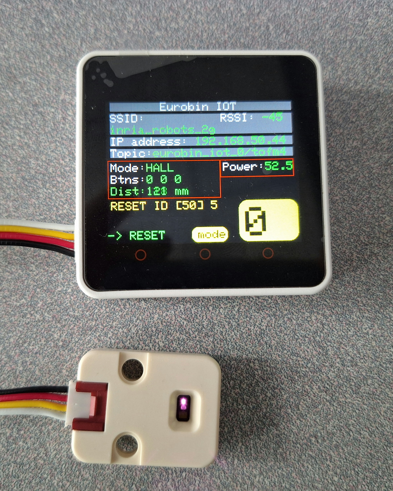

# euROBIN IOT

## Concept

The ideia is to make a software that is fairly easy to connect a sensor to the control and start to work without doing a lot of things. It use Micro Ros and ROS2 to send and receive data from the sensors. 
## Hardware

The project support for the moment Core2 from M5Stack, we are working to make it support for Atom Matrix.

### Supported sensors

All the sensors used are from the company [M5Stack](https://m5stack.com/), you can see bellow the list of sensors used.

- [Time of Flight (Tof)](https://docs.m5stack.com/en/unit/TOF)
- [Scale](https://docs.m5stack.com/en/unit/scales)
- [Hall](https://docs.m5stack.com/en/unit/hall)
- [Key](https://docs.m5stack.com/en/unit/key)

## Compilation and Installation

The project was developed under the Linux Ubuntu 22.04.4 LTS and PlatformIO from VScode.  
First, intall the packages necessary to PlarformIO handle Micro Ros.

```shell
apt install -y git cmake python3-pip
```


It is needed to install **Docker** because it's gonna be necessary to see the topics publishing and receiving.

Clone the project and go to the folder *src/*. You need to configure the wifi so the control can communicate with the local network. Create a header file called **wifi.h** and paste the code bellow inside.

```c++
#ifndef __EUROBIN_IOT_WIFI_H
#define __EUROBIN_IOT_WIFI_H
#define ESSID "NAME_OF_YOUR_NETWORK" 
#define PASSWORD "PASSWORD"
#endif
```

Put the name of your network and password where is written (string for both)

After that, go to *main.cpp* and search for the line of code **IPAddress agent_ip()** and put the IP of your network, separated by colons (for example agent_ip(118, 218, 188, 85)).

Now it's good to go, you can connect your Core2 and upload the code. Here is a image of a Core2 running the code.

{width=50}

You can see on the screen some information like SSID, IP address and etc. You can see the **mode** that inform what sensor should be connected to the Core2, in this case it's the sensor ToF, it has too the data the sensor is seeding to the control. You can see a big number in a green background, this is the ID of the control, it must be a unique ID for each control, if there is 2 control with the same ID, you have to change it for one of them.

If you want to change the sensor touch the middle button and keep it pressed for 5 seconds, it will change for the next mode, you can keep pressing the button to change multiple times the mode until it reach the wished mode. After you have the mode you want, connect the sensor and reset the Core2. It will restart the control and it's going to work with the sensor connected.



If you want to change the ID, keep pressed the right button, it's going to start a counter and you have to keep the button pressed until the counter reach 50, after that the Core2 will restart automatically with a new ID.


You can see if the Core2 is really publishing this information in a topic, you just have to create a docker container ussing the command

```shell
docker run -it --net host ros:humble
```
Inside the container you can check the topics working at the moment with the command 

```shell
ros2 topic list
``` 

Choose the topic you want to see the result and write the command 

```shell
ros2 topic echo name_topic
```
In our case, we want to see the distance of the sensor ToF in the control with the ID 95

```shell
ros2 topic echo eurobin_iot_95/tof
```

Bellow is the output from the terminal 


#Visualising Information from the context of a Washing Machine with a GUI

We have 3 sensors and we want to know if the door, the top drawer and the bottom drawer are opened or not. For this, 3 sensor are going to be used: 1 Hall sensor and 2 ToF. For the GUI we will use Pyqt6. 

Go to the folder docker/ and build the dockerfile to create an image. To build the file, use the command: 

```shell
docker build .
```

After the image is created, run the .sh file to execute the commands and create a container from the image created by the dockerfile. First, give permission to execute the file

```shell
sudo chmod +x command.sh
```

Then execute the file with the absolute path of the folder ros2_ps/ as argument:

```
./command.h absolute_path_ros2_ws
```

Inside the container, go to the folder ros2_ws and write the commands:

```shell
rosdep install -i --from-path src --rosdistro humble -y
colcon build --packages-select meta_node
source install/setup.bash
ros2 launch meta_node parameters_launch.py
```

This will start the node listener, this node is going to receive all the data from the sensors and publish them. You will see on the terminal the log with the information it is receiving.


## Funding

This code is funded by the Horizon project euROBIN: https://www.eurobin-project.eu/